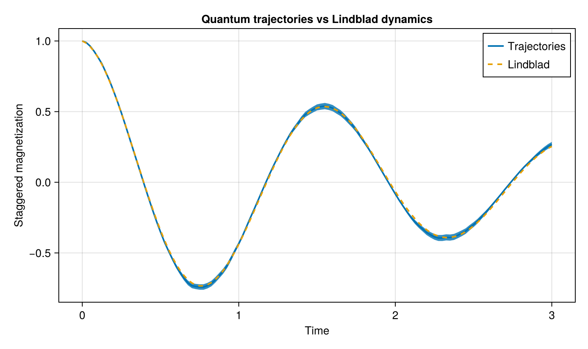
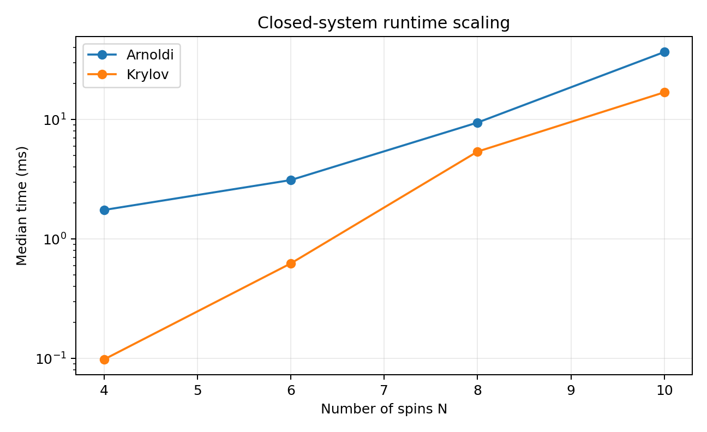
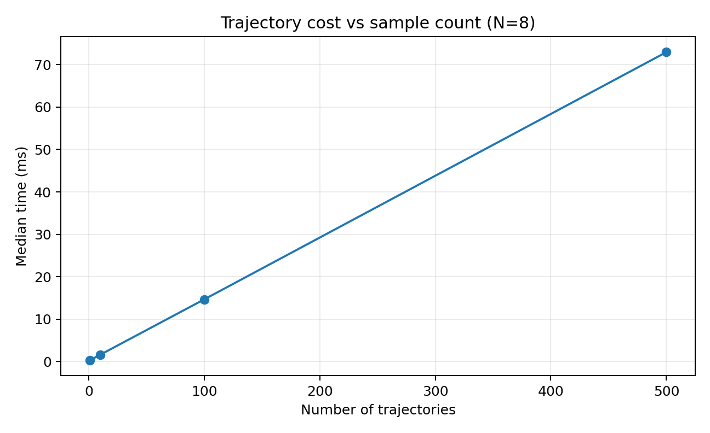

# OpenSpinDynamics.jl

[](https://github.com/javahedi/OpenSpinDynamics.jl/actions/workflows/ci.yml?query=branch%3Amain)
[](https://javahedi.github.io/OpenSpinDynamics.jl/dev/)

<p align="center">
  
</p>

**OpenSpinDynamics.jl** is a Julia package for simulating closed and open quantum spin dynamics.

It provides sparse spin-model construction, Krylov and Arnoldi real-time evolution, Lindblad master-equation dynamics, and stochastic quantum trajectories through a compact high-level API.

> **Status:** OpenSpinDynamics.jl is under active development. The API is usable but may evolve as the package develops.

## Features

- Spin-1/2 model construction with sparse Hamiltonians
- Krylov and Arnoldi real-time evolution
- Lindblad master-equation dynamics
- Stochastic quantum trajectories
- Nearest-neighbor couplings
- Clean power-law long-range couplings
- Disordered long-range couplings
- Néel and polarized product states
- Sparse single-site spin operators
- Unified `evolve` interface based on `SpinModel`

## Installation

OpenSpinDynamics.jl supports Julia versions compatible with the package's `Project.toml`.

Until registration in the Julia General registry, install directly from GitHub:

```julia
using Pkg
Pkg.add(url="https://github.com/javahedi/OpenSpinDynamics.jl")
```

## Quick start

Construct a nearest-neighbor XXZ model and evolve a Néel state:

```julia
using OpenSpinDynamics

N = 4

coupling = NearestNeighborCoupling(0.0, N)

model = SpinModel(
    N;
    Jxy=1.0,
    Jz=1.0,
    coupling=coupling,
)

ψ0 = neel_state(N)

ops = spin_operators(N)

times = collect(range(0.0, 2.0; length=51))

result = evolve(
    model,
    ψ0,
    times,
    [ops.z[1]];
    method=:krylov,
)
```

Arnoldi evolution uses the same interface:

```julia
result = evolve(
    model,
    ψ0,
    times,
    [ops.z[1]];
    method=:arnoldi,
)
```

## Open-system dynamics

Open-system evolution uses the same `SpinModel` together with Lindblad collapse operators.

For local spontaneous emission,

```math
L_i = \sqrt{\gamma}\,\sigma_i^-.
```

construct the collapse operators with:

```julia
γ = 0.2

lindblad_ops = [
    sqrt(γ) * ops.minus[i]
    for i in 1:N
]
```

### Lindblad master equation

For density-matrix evolution:

```julia
ρ0 = sparse(ψ0 * ψ0')

result = evolve(
    model,
    ρ0,
    times,
    [ops.z[1]];
    method=:expm,
    lindblad_ops=lindblad_ops,
)
```

The Lindblad interface supports `method=:expm` and `method=:ode`.

### Quantum trajectories

The same dissipative model can be simulated using stochastic quantum trajectories:

```julia
mean_values, std_values = evolve(
    model,
    ψ0,
    times,
    [ops.z[1]];
    method=:trajectories,
    lindblad_ops=lindblad_ops,
    num_samples=500,
)
```

This returns the trajectory-averaged observables together with their sample standard deviations.

## Documentation

Full documentation, tutorials, worked examples, and the API reference are available at:

- [Documentation](https://javahedi.github.io/OpenSpinDynamics.jl/dev/)

The documentation includes examples of:

- closed XXZ dynamics
- amplitude damping
- dissipative XXZ dynamics
- stochastic trajectories compared with Lindblad evolution

## Examples

The maintained examples are part of the documentation:

- [`Closed XXZ dynamics`](docs/src/examples/closed_xxz.md)
- [`Amplitude damping`](docs/src/examples/amplitude_damping.md)
- [`Dissipative XXZ dynamics`](docs/src/examples/dissipative_xxz.md)
- [`Trajectories vs Lindblad`](docs/src/examples/trajectories_vs_lindblad.md)

These examples are built with Documenter.jl and include executable code and plots.

## Public API

| Task | Function / type |
| --- | --- |
| Spin-model construction | `SpinModel` |
| Update an existing model | `update_model!` |
| Nearest-neighbor coupling | `NearestNeighborCoupling` |
| Clean long-range coupling | `LongRangeCouplingClean` |
| Disordered long-range coupling | `LongRangeCouplingDisorder` |
| Néel product state | `neel_state` |
| Polarized product state | `polarized_state` |
| Spin operators | `spin_operators`, `SpinOperators` |
| Closed-system evolution | `evolve(...; method=:krylov)` |
| Arnoldi evolution | `evolve(...; method=:arnoldi)` |
| Lindblad evolution | `evolve(...; method=:expm)` / `:ode` |
| Quantum trajectories | `evolve(...; method=:trajectories)` |

The low-level solver implementation remains internal so that the public API stays focused on physical models, states, observables, and evolution.

## Testing

Run the complete test suite with:

```bash
julia --project=. -e 'using Pkg; Pkg.test()'
```

The test suite is also run through GitHub Actions.

Build the documentation locally with:

```bash
julia --project=docs docs/make.jl
```

## Performance

Representative benchmarks were run on an Apple M1 with Julia 1.12.6.

<p align="center">
  
</p>

Krylov is currently the preferred closed-system backend, while stochastic trajectories show near-linear scaling with trajectory count.

<p align="center">
  
</p>

For `N=8` and 100 trajectories, allocation-focused optimization reduced runtime from about **56.8 ms to 14.6 ms**, allocated memory from **274 MiB to about 1 MiB**, and allocations from roughly **234k to 683**.

See the documentation for benchmark methodology and environment details.


## Performance & collaboration

Current development focuses on scalable open-system simulation, reduced allocations, reproducible stochastic trajectories, and efficient sparse propagation.

Contributions are especially welcome in:

- threaded and distributed trajectory sampling
- GPU acceleration
- matrix-free Lindblad methods
- steady-state solvers
- additional dissipative models
- reproducible cross-package benchmarks


## License

OpenSpinDynamics.jl is distributed under the terms of the repository's [`LICENSE`](LICENSE) file.
